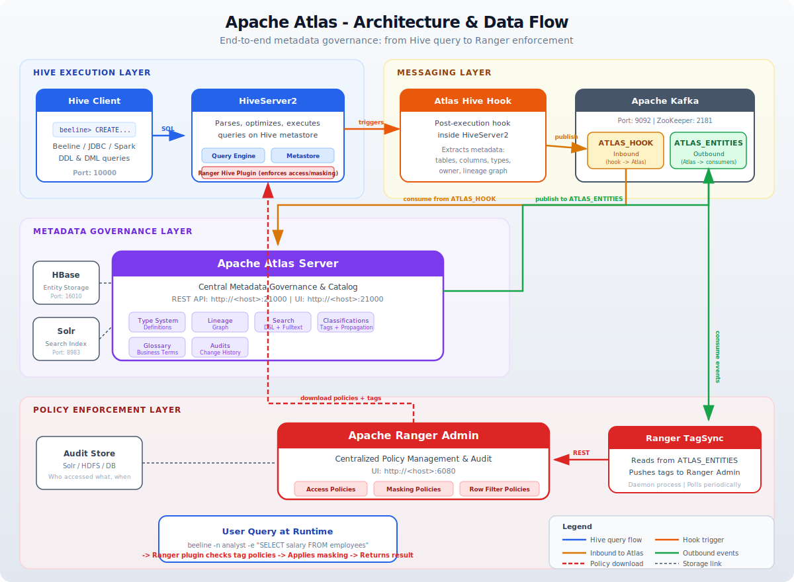
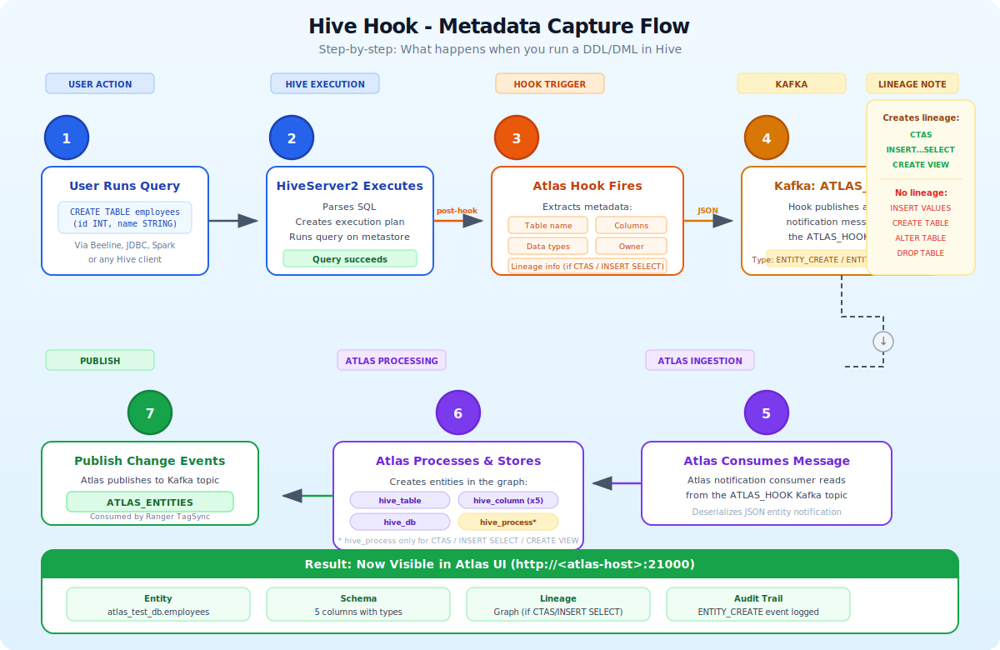
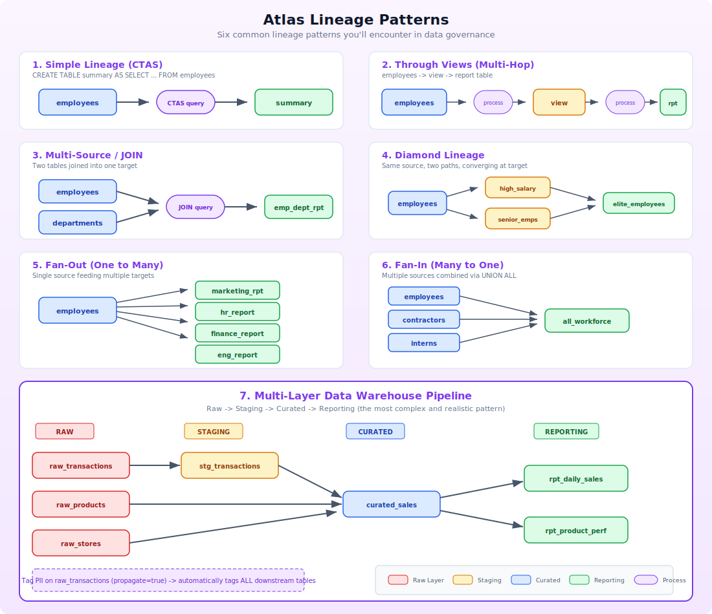
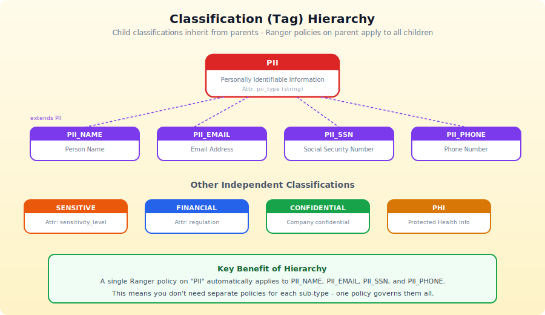
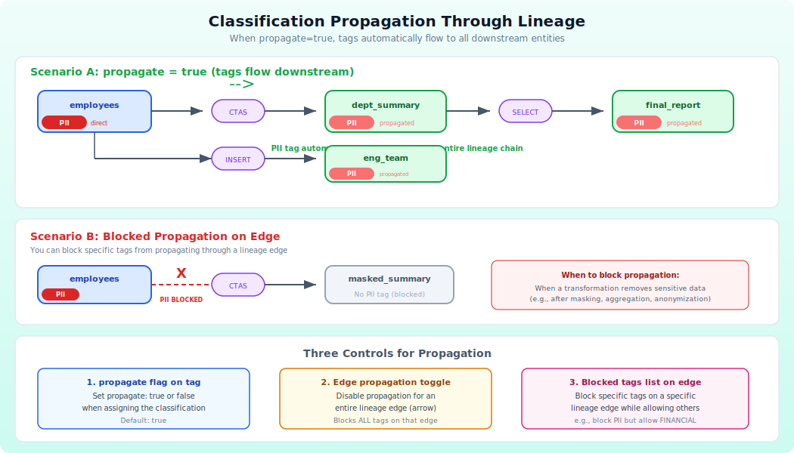
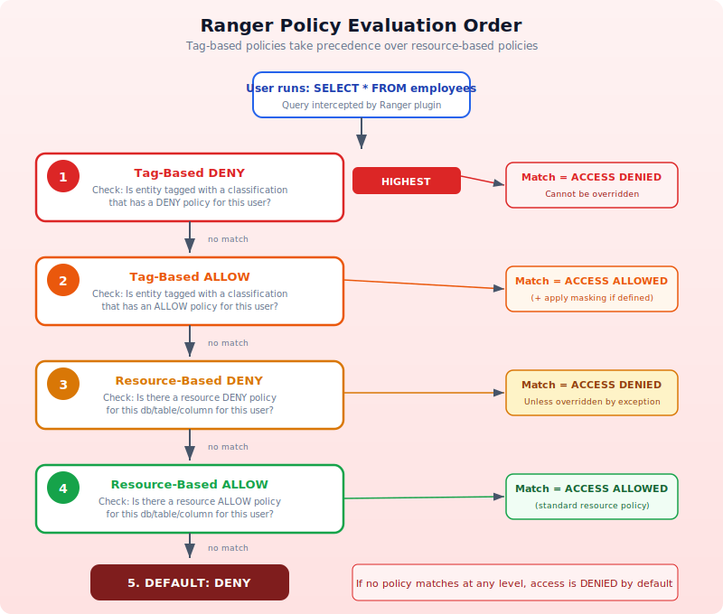
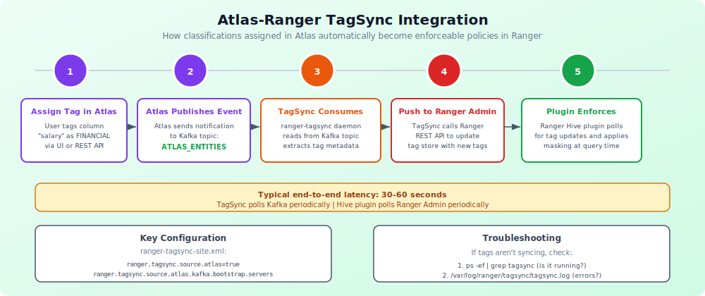
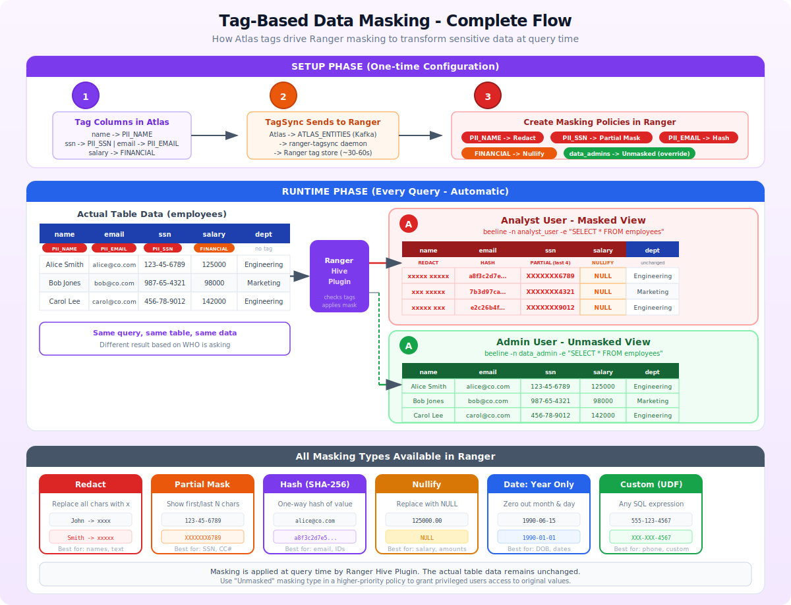
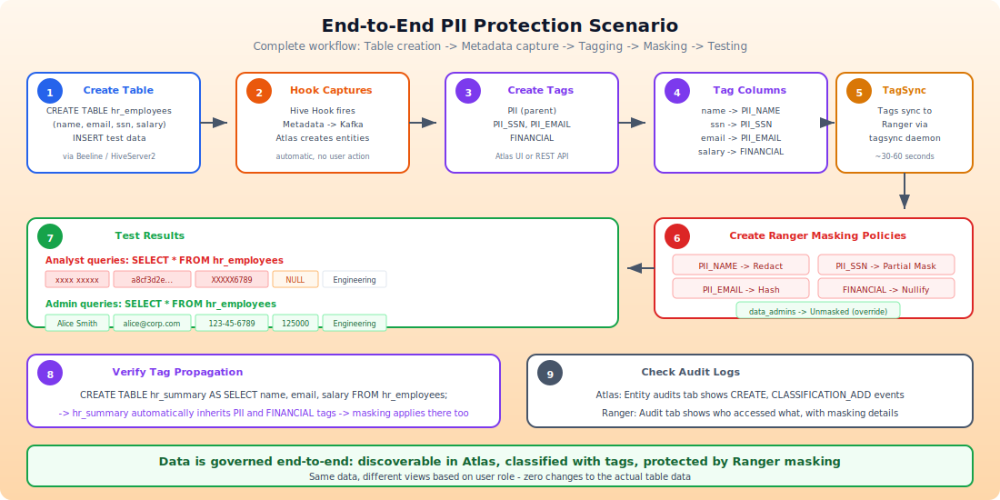

# Apache Atlas - Complete Testing & Use Case Guide

> A beginner-friendly, hands-on guide covering every major Apache Atlas feature: metadata capture via Hive hooks, complex lineage tracking, classifications/tags, Ranger integration, tag-based masking, row-level filtering, glossary, custom types, auditing, and troubleshooting.

### Visual Diagrams

All diagrams are in the [diagrams/](diagrams/) folder and can be opened in any browser:

| Diagram | File | What It Explains |
|---------|------|------------------|
| Architecture Overview | [01-architecture-overview.svg](diagrams/01-architecture-overview.svg) | Full system architecture: Hive -> Hook -> Kafka -> Atlas -> TagSync -> Ranger |
| Hive Hook Flow | [02-hive-hook-flow.svg](diagrams/02-hive-hook-flow.svg) | Step-by-step flow of how a CREATE TABLE becomes metadata in Atlas |
| Lineage Patterns | [03-lineage-patterns.svg](diagrams/03-lineage-patterns.svg) | 7 lineage patterns: simple, views, JOIN, diamond, fan-out, fan-in, warehouse |
| Classification Hierarchy | [04-classification-hierarchy.svg](diagrams/04-classification-hierarchy.svg) | PII tag hierarchy with inheritance (PII_NAME, PII_SSN, etc.) |
| Classification Propagation | [05-classification-propagation.svg](diagrams/05-classification-propagation.svg) | How tags propagate through lineage + 3 control mechanisms |
| Ranger Policy Evaluation | [06-ranger-policy-evaluation.svg](diagrams/06-ranger-policy-evaluation.svg) | 5-step policy evaluation order (tag deny -> tag allow -> resource deny -> resource allow -> default deny) |
| Data Masking Flow | [07-data-masking-flow.svg](diagrams/07-data-masking-flow.svg) | Complete masking flow: setup, runtime, before/after comparison, all masking types |
| TagSync Integration | [08-tagsync-flow.svg](diagrams/08-tagsync-flow.svg) | 5-step TagSync timeline from Atlas tag assignment to Ranger enforcement |
| End-to-End Scenario | [09-end-to-end-scenario.svg](diagrams/09-end-to-end-scenario.svg) | Full 9-step PII protection workflow with test results |

---

## Table of Contents

1. [Prerequisites & Environment Setup](#1-prerequisites--environment-setup)
2. [Understanding the Architecture](#2-understanding-the-architecture)
3. [Hive Hook - Automatic Metadata Capture](#3-hive-hook---automatic-metadata-capture)
4. [Lineage Tracking - Simple to Complex](#4-lineage-tracking---simple-to-complex)
5. [Atlas Classifications (Tags)](#5-atlas-classifications-tags)
6. [Assigning Tags to Entities](#6-assigning-tags-to-entities)
7. [Classification Propagation](#7-classification-propagation)
8. [Atlas Search - All Methods](#8-atlas-search---all-methods)
9. [Ranger Resource-Based Policies](#9-ranger-resource-based-policies)
10. [Ranger Tag-Based Policies (Atlas Integration)](#10-ranger-tag-based-policies-atlas-integration)
11. [Tag-Based Data Masking](#11-tag-based-data-masking)
12. [Row-Level Filtering](#12-row-level-filtering)
13. [Glossary & Business Metadata](#13-glossary--business-metadata)
14. [Custom Type Definitions](#14-custom-type-definitions)
15. [Auditing & Monitoring](#15-auditing--monitoring)
16. [Complex Lineage Scenarios](#16-complex-lineage-scenarios)
17. [End-to-End Test Scenarios](#17-end-to-end-test-scenarios)
18. [Troubleshooting Guide](#18-troubleshooting-guide)
19. [Quick Reference - API Endpoints](#19-quick-reference---api-endpoints)

---

## 1. Prerequisites & Environment Setup

### 1.1 Required Services

| Service              | Default Port | URL / Connection                         | Purpose                          |
|----------------------|-------------|------------------------------------------|----------------------------------|
| Atlas UI             | 21000       | `http://<atlas-host>:21000`              | Metadata governance UI           |
| HiveServer2          | 10000       | `jdbc:hive2://<hive-host>:10000`         | SQL engine                       |
| Ranger Admin UI      | 6080        | `http://<ranger-host>:6080`              | Policy management                |
| Kafka                | 9092        | `<kafka-host>:9092`                      | Message broker for Atlas hooks   |
| Solr                 | 8983        | `http://<solr-host>:8983`                | Atlas search index backend       |
| ZooKeeper            | 2181        | `<zk-host>:2181`                         | Coordination service             |
| Ranger TagSync       | -           | Daemon process                           | Syncs Atlas tags to Ranger       |
| HBase (if used)      | 16010       | `http://<hbase-host>:16010`              | Atlas metadata storage backend   |

### 1.2 Default Credentials

| Service | Username | Password |
|---------|----------|----------|
| Atlas   | `admin`  | `admin`  |
| Ranger  | `admin`  | `admin`  |
| Hive    | `hive`   | (varies) |

### 1.3 Verify All Services Are Running

```bash
# ---- Atlas ----
curl -u admin:admin http://<atlas-host>:21000/api/atlas/v2/types/typedefs/headers
# Expected: JSON array of type definition headers

# ---- Ranger ----
curl -u admin:admin http://<ranger-host>:6080/service/public/v2/api/service
# Expected: JSON list of services

# ---- Hive ----
beeline -u "jdbc:hive2://<hive-host>:10000" -n hive -e "SHOW DATABASES;"
# Expected: list of databases

# ---- Kafka ----
kafka-topics --list --zookeeper <zk-host>:2181 | grep -i atlas
# Expected: ATLAS_HOOK and ATLAS_ENTITIES topics

# ---- Ranger TagSync ----
ps -ef | grep tagsync
# Expected: running tagsync process

# ---- Atlas Metrics (overall health) ----
curl -s -u admin:admin http://<atlas-host>:21000/api/atlas/admin/metrics | python -m json.tool
```

### 1.4 Key Configuration Files to Know

| File                                     | Location (typical)                   | Purpose                                    |
|------------------------------------------|--------------------------------------|--------------------------------------------|
| `atlas-application.properties`           | `/etc/atlas/conf/`                   | Atlas server config                        |
| `atlas-application.properties` (Hive)    | `/etc/hive/conf/`                    | Hive hook config for Atlas                 |
| `hive-site.xml`                          | `/etc/hive/conf/`                    | Hive settings including hook registration  |
| `ranger-tagsync-site.xml`               | `/etc/ranger/tagsync/conf/`          | TagSync daemon config                      |
| `atlas-log4j.xml`                        | `/etc/atlas/conf/`                   | Atlas logging config                       |

---

## 2. Understanding the Architecture

> 

### 2.1 How Data Flows Through the System

```
                                  ATLAS_HOOK (Kafka topic)
  Hive DDL/DML  ──>  Hive Hook  ──────────────────────>  Atlas Server
  (CREATE TABLE,                                             │
   INSERT SELECT,                                            │ stores metadata
   CTAS, etc.)                                               │ in HBase/Solr
                                                             │
                                  ATLAS_ENTITIES (Kafka)     │
                              <──────────────────────────────┘
                              │
                              v
                        Ranger TagSync  ──>  Ranger Admin (Tag Store)
                                                    │
                                                    │ policies evaluated
                                                    v
                                            Ranger Hive Plugin
                                            (enforces access/masking)
```

### 2.2 Key Concepts

| Concept              | What It Is                                                                 |
|----------------------|----------------------------------------------------------------------------|
| **Entity**           | A metadata object in Atlas (e.g., `hive_table`, `hive_column`, `hdfs_path`) |
| **Type**             | The schema/blueprint for an entity (like a class definition)               |
| **Classification**   | A tag/label attached to entities (e.g., `PII`, `SENSITIVE`)                |
| **Lineage**          | A directed graph showing data flow between entities                        |
| **Glossary**         | Business terms that can be attached to entities                            |
| **Propagation**      | Automatic spreading of classifications through lineage                     |
| **GUID**             | Globally Unique Identifier - every entity has one                          |
| **qualifiedName**    | Human-readable unique name (e.g., `db.table@cluster`)                      |

### 2.3 What Triggers Atlas Metadata Capture

| Hive Operation              | What Atlas Captures                          | Creates Lineage? |
|----------------------------|----------------------------------------------|-------------------|
| `CREATE DATABASE`           | `hive_db` entity                             | No                |
| `CREATE TABLE`              | `hive_table` + `hive_column` entities        | No                |
| `CREATE EXTERNAL TABLE`     | `hive_table` + `hdfs_path` entity            | No                |
| `CREATE TABLE AS SELECT`    | New table + `hive_process` + lineage         | **Yes**           |
| `INSERT INTO ... SELECT`    | `hive_process` + lineage                     | **Yes**           |
| `CREATE VIEW`               | `hive_table` (view) + lineage                | **Yes**           |
| `INSERT INTO ... VALUES`    | Data only (no process entity)                | **No**            |
| `ALTER TABLE`               | Updates existing entity                      | No                |
| `DROP TABLE`                | Marks entity as deleted                      | No                |

---

## 3. Hive Hook - Automatic Metadata Capture

> 

### 3.1 Verify Hive Hook Configuration

**Check that the Atlas Hive hook is registered:**

```bash
# Look for Atlas hook in hive-site.xml
grep -A2 "hive.exec.post.hooks" /etc/hive/conf/hive-site.xml
```

**Expected configuration:**
```xml
<property>
    <name>hive.exec.post.hooks</name>
    <value>org.apache.atlas.hive.hook.HiveHook</value>
</property>
```

**Check atlas-application.properties in the Hive conf directory:**
```properties
# Atlas server connection
atlas.rest.address=http://<atlas-host>:21000

# Kafka settings for hook notifications
atlas.kafka.bootstrap.servers=<kafka-host>:9092
atlas.kafka.zookeeper.connect=<zk-host>:2181

# Hook behavior
atlas.hook.hive.synchronous=false    # async = better performance
atlas.hook.hive.numRetries=3         # retry on failure
atlas.cluster.name=primary           # cluster identifier used in qualifiedName
```

**Verify Kafka topics exist:**
```bash
kafka-topics --list --zookeeper <zk-host>:2181 | grep -i atlas
# Expected output:
#   ATLAS_HOOK       (Hive hook sends notifications here)
#   ATLAS_ENTITIES   (Atlas publishes change events here)
```

---

### 3.2 Test Case: Create a Database

**Purpose:** Verify Atlas captures database creation metadata.

```bash
beeline -u "jdbc:hive2://<hive-host>:10000" -n hive
```

```sql
CREATE DATABASE IF NOT EXISTS atlas_test_db
COMMENT 'Test database for Atlas metadata governance testing';
```

**Verify in Atlas UI:**
1. Navigate to `http://<atlas-host>:21000`
2. Login: `admin` / `admin`
3. Search: type `atlas_test_db` in the search bar
4. Expected: a `hive_db` entity appears with:
   - Name: `atlas_test_db`
   - Owner: `hive`
   - Comment: `Test database for Atlas metadata governance testing`

**Verify via API:**
```bash
curl -s -u admin:admin \
  "http://<atlas-host>:21000/api/atlas/v2/search/basic?typeName=hive_db&query=atlas_test_db" \
  | python -m json.tool
```

---

### 3.3 Test Case: Create a Simple Table

**Purpose:** Verify Atlas captures table + column metadata automatically.

```sql
USE atlas_test_db;

CREATE TABLE employees (
    emp_id      INT         COMMENT 'Employee ID - primary identifier',
    name        STRING      COMMENT 'Employee full name',
    department  STRING      COMMENT 'Department name',
    salary      DOUBLE      COMMENT 'Annual salary in USD',
    hire_date   DATE        COMMENT 'Date of hire'
)
COMMENT 'Employee master table for Atlas testing'
ROW FORMAT DELIMITED
FIELDS TERMINATED BY ','
STORED AS TEXTFILE;
```

**Verify in Atlas UI:**
1. Search for `employees`
2. Click on `atlas_test_db.employees` (type: `hive_table`)
3. Check each tab:

| Tab               | Expected Content                                      |
|--------------------|-------------------------------------------------------|
| **Properties**     | Name, owner, create time, database, table type        |
| **Schema**         | 5 columns: emp_id (INT), name (STRING), etc.          |
| **Lineage**        | Empty (no lineage source yet)                         |
| **Classifications**| Empty (no tags assigned yet)                          |
| **Audits**         | One entry: `ENTITY_CREATE` with timestamp             |

**Verify via API:**
```bash
# Search for the table
curl -s -u admin:admin \
  "http://<atlas-host>:21000/api/atlas/v2/search/basic?typeName=hive_table&query=employees" \
  | python -m json.tool

# Get detailed entity by GUID (replace <GUID> with actual value from search)
curl -s -u admin:admin \
  "http://<atlas-host>:21000/api/atlas/v2/entity/guid/<GUID>" \
  | python -m json.tool
```

---

### 3.4 Test Case: Table with Complex Data Types

**Purpose:** Verify Atlas captures ARRAY, MAP, STRUCT, and nested complex types.

```sql
USE atlas_test_db;

CREATE TABLE employee_details (
    emp_id          INT                     COMMENT 'Employee ID',
    name            STRING                  COMMENT 'Full name',
    phone_numbers   ARRAY<STRING>           COMMENT 'List of phone numbers',
    address         STRUCT<
                        street: STRING,
                        city:   STRING,
                        state:  STRING,
                        zip:    STRING
                    >                       COMMENT 'Home address',
    skills          MAP<STRING, INT>        COMMENT 'Skill name to proficiency 1-10',
    projects        ARRAY<STRUCT<
                        project_name: STRING,
                        role:         STRING,
                        start_date:   DATE
                    >>                      COMMENT 'Project history'
)
COMMENT 'Employee details with complex/nested types'
STORED AS ORC;
```

**Insert test data:**
```sql
INSERT INTO employee_details
SELECT
    1,
    'John Doe',
    array('555-0101', '555-0102'),
    named_struct('street', '123 Main St', 'city', 'Springfield', 'state', 'IL', 'zip', '62701'),
    map('Java', 9, 'Python', 7, 'SQL', 8),
    array(
        named_struct('project_name', 'Atlas Migration', 'role', 'Lead',      'start_date', cast('2025-01-15' as date)),
        named_struct('project_name', 'Data Lake',       'role', 'Developer', 'start_date', cast('2025-06-01' as date))
    );

INSERT INTO employee_details
SELECT
    2,
    'Jane Smith',
    array('555-0201'),
    named_struct('street', '456 Oak Ave', 'city', 'Portland', 'state', 'OR', 'zip', '97201'),
    map('Scala', 8, 'Spark', 9, 'Hive', 7),
    array(
        named_struct('project_name', 'ETL Pipeline', 'role', 'Architect', 'start_date', cast('2024-03-01' as date))
    );
```

**Verify in Atlas:**
- Search for `employee_details`
- Go to **Schema** tab
- Verify all columns show correct complex types:
  - `phone_numbers` -> `array<string>`
  - `address` -> `struct<street:string,city:string,state:string,zip:string>`
  - `skills` -> `map<string,int>`
  - `projects` -> `array<struct<project_name:string,role:string,start_date:date>>`

---

### 3.5 Test Case: Partitioned Table

**Purpose:** Verify Atlas captures partition keys as metadata.

```sql
CREATE TABLE sales_data (
    transaction_id  BIGINT,
    customer_id     INT,
    product_name    STRING,
    amount          DECIMAL(10,2),
    quantity        INT
)
PARTITIONED BY (sale_year INT, sale_month INT)
STORED AS PARQUET;

-- Add some partitions
ALTER TABLE sales_data ADD PARTITION (sale_year=2025, sale_month=1);
ALTER TABLE sales_data ADD PARTITION (sale_year=2025, sale_month=2);
ALTER TABLE sales_data ADD PARTITION (sale_year=2025, sale_month=3);
```

**Verify in Atlas:**
- Table entity shows partition columns (`sale_year`, `sale_month`) in the Schema tab
- Properties show `partitionKeys` attribute

---

### 3.6 Test Case: Bucketed Table

```sql
CREATE TABLE customer_orders (
    order_id        BIGINT,
    customer_id     INT,
    order_date      TIMESTAMP,
    total_amount    DECIMAL(12,2),
    status          STRING
)
CLUSTERED BY (customer_id) INTO 8 BUCKETS
STORED AS ORC;
```

**Verify:** Table properties in Atlas show clustering/bucket information.

---

### 3.7 Test Case: External Table (HDFS Path Tracking)

**Purpose:** Verify Atlas tracks both the table AND the underlying HDFS location.

```sql
CREATE EXTERNAL TABLE external_logs (
    log_timestamp   TIMESTAMP,
    log_level       STRING,
    service_name    STRING,
    message         STRING
)
ROW FORMAT DELIMITED
FIELDS TERMINATED BY '\t'
LOCATION '/data/logs/external_logs';
```

**Verify in Atlas:**
1. Search for `external_logs` -> `hive_table` entity with `tableType: EXTERNAL_TABLE`
2. Search for `/data/logs/external_logs` -> `hdfs_path` entity
3. The table entity has a relationship pointing to the HDFS path entity

---

### 3.8 Test Case: ALTER TABLE Operations

**Purpose:** Verify Atlas captures schema changes.

```sql
-- Add a column
ALTER TABLE employees ADD COLUMNS (email STRING COMMENT 'Email address');

-- Rename table
ALTER TABLE customer_orders RENAME TO cust_orders;

-- Change column type (if supported)
-- ALTER TABLE employees CHANGE COLUMN salary salary DECIMAL(12,2);
```

**Verify in Atlas:**
- `employees` schema now shows 6 columns (including `email`)
- `customer_orders` is gone, `cust_orders` appears (or `customer_orders` is updated)
- Audits tab shows the ALTER events

---

### 3.9 Test Case: DROP TABLE

**Purpose:** Verify Atlas marks the entity as deleted (soft delete).

```sql
DROP TABLE IF EXISTS cust_orders;
```

**Verify in Atlas:**
- By default, searching won't show deleted entities
- Enable "Show historical entities" in search to see it marked as `DELETED`
- The entity's audits tab shows the DROP event

---

## 4. Lineage Tracking - Simple to Complex

> 

Lineage is one of Atlas's most powerful features. It shows how data flows from source to destination.

### 4.1 Seed Data for Lineage Tests

```sql
USE atlas_test_db;

-- Insert test data into employees
INSERT INTO employees VALUES
(1,  'Alice Smith',     'Engineering', 120000.00, '2023-01-15'),
(2,  'Bob Johnson',     'Marketing',   95000.00,  '2023-03-20'),
(3,  'Carol Williams',  'Engineering', 135000.00, '2022-06-01'),
(4,  'David Brown',     'HR',          88000.00,  '2024-01-10'),
(5,  'Eve Davis',       'Marketing',  102000.00,  '2023-09-05'),
(6,  'Frank Miller',    'Engineering', 145000.00, '2021-11-15'),
(7,  'Grace Lee',       'Finance',    115000.00,  '2023-05-22'),
(8,  'Henry Wilson',    'HR',          92000.00,  '2024-03-01'),
(9,  'Irene Taylor',    'Finance',    128000.00,  '2022-08-10'),
(10, 'Jack Anderson',   'Marketing',  105000.00,  '2023-11-30');
```

---

### 4.2 Simple Lineage: CTAS (Create Table As Select)

**Purpose:** Single source table -> new derived table.

```sql
CREATE TABLE dept_salary_summary AS
SELECT
    department,
    COUNT(*)    AS emp_count,
    ROUND(AVG(salary), 2)  AS avg_salary,
    MAX(salary) AS max_salary,
    MIN(salary) AS min_salary
FROM employees
GROUP BY department;
```

**Lineage Graph:**
```
 [employees]  ──>  [hive_process: CTAS query]  ──>  [dept_salary_summary]
```

**How to Verify:**
1. Atlas UI -> Search `dept_salary_summary` -> **Lineage** tab
2. You should see a directed graph with:
   - Source: `employees` (input)
   - Process: the CTAS SQL query (click to see the actual SQL)
   - Target: `dept_salary_summary` (output)

**Verify via API:**
```bash
# Get lineage (replace <GUID> with dept_salary_summary's GUID)
curl -s -u admin:admin \
  "http://<atlas-host>:21000/api/atlas/v2/lineage/<GUID>?direction=BOTH&depth=10" \
  | python -m json.tool
```

The response includes:
- `guidEntityMap`: all entities in the lineage graph
- `relations`: the edges connecting them (with `fromEntityId` and `toEntityId`)

---

### 4.3 Simple Lineage: INSERT...SELECT

**Purpose:** Shows lineage for data movement between existing tables.

```sql
CREATE TABLE engineering_team (
    emp_id      INT,
    name        STRING,
    salary      DOUBLE,
    hire_date   DATE
);

INSERT INTO engineering_team
SELECT emp_id, name, salary, hire_date
FROM employees
WHERE department = 'Engineering';
```

**Lineage Graph:**
```
 [employees]  ──>  [hive_process: INSERT SELECT]  ──>  [engineering_team]
```

---

### 4.4 Lineage Through Views

**Purpose:** Views appear as intermediate nodes in lineage.

```sql
-- Create a view
CREATE VIEW high_earners_view AS
SELECT emp_id, name, department, salary
FROM employees
WHERE salary > 100000;

-- Create a table from the view
CREATE TABLE high_earners_report AS
SELECT * FROM high_earners_view;
```

**Lineage Graph:**
```
 [employees]  ──>  [hive_process]  ──>  [high_earners_view]  ──>  [hive_process]  ──>  [high_earners_report]
```

**Verify:** Navigate to `high_earners_report` lineage tab - you should see the full chain back to `employees` through the view.

---

### 4.5 Multi-Source Lineage: JOIN

**Purpose:** Two or more source tables feeding into one target.

```sql
CREATE TABLE departments (
    dept_name   STRING,
    location    STRING,
    manager     STRING,
    budget      DECIMAL(15,2)
);

INSERT INTO departments VALUES
('Engineering', 'Building A - Floor 3', 'Alice Smith',  5000000.00),
('Marketing',   'Building B - Floor 1', 'Bob Johnson',  3000000.00),
('HR',          'Building C - Floor 2', 'David Brown',   2000000.00),
('Finance',     'Building A - Floor 5', 'Grace Lee',    4000000.00);

-- JOIN two tables -> multi-source lineage
CREATE TABLE employee_dept_report AS
SELECT
    e.emp_id,
    e.name,
    e.salary,
    e.hire_date,
    d.location,
    d.manager AS dept_manager,
    d.budget  AS dept_budget
FROM employees e
JOIN departments d ON e.department = d.dept_name;
```

**Lineage Graph:**
```
 [employees]    ──┐
                  ├──>  [hive_process: JOIN]  ──>  [employee_dept_report]
 [departments]  ──┘
```

**This is a key test:** The lineage graph should show BOTH `employees` AND `departments` as inputs.

---

### 4.6 Multi-Hop Lineage: Chained Transformations

**Purpose:** Data flows through multiple stages of transformation.

```sql
-- Stage 1: Filter engineering employees
CREATE TABLE stage1_eng_employees AS
SELECT emp_id, name, salary, hire_date
FROM employees
WHERE department = 'Engineering';

-- Stage 2: Add tenure calculation
CREATE TABLE stage2_eng_with_tenure AS
SELECT
    emp_id,
    name,
    salary,
    hire_date,
    DATEDIFF(current_date(), hire_date) AS tenure_days,
    ROUND(DATEDIFF(current_date(), hire_date) / 365.25, 1) AS tenure_years
FROM stage1_eng_employees;

-- Stage 3: Final report with salary band
CREATE TABLE stage3_eng_salary_report AS
SELECT
    emp_id,
    name,
    salary,
    tenure_years,
    CASE
        WHEN salary >= 140000 THEN 'Senior Band'
        WHEN salary >= 120000 THEN 'Mid Band'
        ELSE 'Junior Band'
    END AS salary_band
FROM stage2_eng_with_tenure;
```

**Lineage Graph (Multi-Hop):**
```
 [employees] ──> [stage1_eng_employees] ──> [stage2_eng_with_tenure] ──> [stage3_eng_salary_report]
```

**Verify:** Navigate to `stage3_eng_salary_report` lineage and set depth to 10. You should see the full chain back to `employees`.

---

### 4.7 Diamond Lineage: Multiple Paths Converging

**Purpose:** Same source table contributes to a target through different intermediate tables.

```sql
-- Path 1: High earners
CREATE TABLE high_salary_emps AS
SELECT emp_id, name, salary, department
FROM employees
WHERE salary > 110000;

-- Path 2: Senior employees (by hire date)
CREATE TABLE senior_emps AS
SELECT emp_id, name, hire_date, department
FROM employees
WHERE hire_date < '2023-01-01';

-- Converge: Join both paths
CREATE TABLE elite_employees AS
SELECT
    h.emp_id,
    h.name,
    h.salary,
    s.hire_date,
    h.department
FROM high_salary_emps h
JOIN senior_emps s ON h.emp_id = s.emp_id;
```

**Lineage Graph (Diamond):**
```
                ┌──> [high_salary_emps] ──┐
 [employees] ──┤                          ├──> [elite_employees]
                └──> [senior_emps]     ──┘
```

**Why this matters:** This tests Atlas's ability to track multiple lineage paths from the same source converging on a single target.

---

### 4.8 Fan-Out Lineage: One Source, Many Targets

**Purpose:** A single source table feeding multiple downstream tables.

```sql
-- Multiple targets from one source
CREATE TABLE marketing_report AS
SELECT emp_id, name, salary FROM employees WHERE department = 'Marketing';

CREATE TABLE hr_report AS
SELECT emp_id, name, salary, hire_date FROM employees WHERE department = 'HR';

CREATE TABLE finance_report AS
SELECT emp_id, name, salary FROM employees WHERE department = 'Finance';

CREATE TABLE engineering_report AS
SELECT emp_id, name, salary, hire_date FROM employees WHERE department = 'Engineering';
```

**Lineage Graph (Fan-Out):**
```
                  ┌──> [marketing_report]
                  ├──> [hr_report]
 [employees] ────┤
                  ├──> [finance_report]
                  └──> [engineering_report]
```

**Verify:** Navigate to `employees` lineage with direction=`OUTPUT`. All four downstream tables should be visible.

---

### 4.9 Fan-In Lineage: Many Sources, One Target

**Purpose:** Multiple independent source tables being combined.

```sql
CREATE TABLE contractors (
    id INT, name STRING, rate DECIMAL(10,2), department STRING
);
INSERT INTO contractors VALUES
(101, 'Pat Contractor', 150.00, 'Engineering'),
(102, 'Sam Freelance',  120.00, 'Marketing');

CREATE TABLE interns (
    id INT, name STRING, stipend DECIMAL(10,2), department STRING
);
INSERT INTO interns VALUES
(201, 'Kim Intern',  2500.00, 'Engineering'),
(202, 'Lee Student', 2000.00, 'Finance');

-- Combine employees + contractors + interns
CREATE TABLE all_workforce AS
SELECT emp_id AS id, name, salary AS compensation, department, 'Employee' AS type
FROM employees
UNION ALL
SELECT id, name, rate, department, 'Contractor' AS type
FROM contractors
UNION ALL
SELECT id, name, stipend, department, 'Intern' AS type
FROM interns;
```

**Lineage Graph (Fan-In):**
```
 [employees]   ──┐
 [contractors] ──┼──> [all_workforce]
 [interns]     ──┘
```

---

### 4.10 Complex Lineage: Multi-Layer Data Warehouse Pattern

**Purpose:** Simulates a real-world ETL pipeline with raw -> staging -> curated -> reporting layers.

```sql
-- ========== RAW LAYER ==========
CREATE TABLE raw_transactions (
    txn_id      BIGINT,
    customer_id INT,
    product_id  INT,
    amount      DECIMAL(10,2),
    txn_date    STRING,
    store_id    INT
);

INSERT INTO raw_transactions VALUES
(1001, 1, 101, 29.99,  '2025-01-15', 1),
(1002, 2, 102, 149.99, '2025-01-15', 2),
(1003, 1, 103, 9.99,   '2025-01-16', 1),
(1004, 3, 101, 29.99,  '2025-01-16', 3),
(1005, 2, 104, 79.99,  '2025-01-17', 2);

CREATE TABLE raw_products (
    product_id   INT,
    product_name STRING,
    category     STRING,
    unit_cost    DECIMAL(10,2)
);

INSERT INTO raw_products VALUES
(101, 'Widget A',  'Electronics', 12.50),
(102, 'Gadget B',  'Electronics', 65.00),
(103, 'Accessory C','Accessories', 3.50),
(104, 'Device D',  'Electronics', 35.00);

CREATE TABLE raw_stores (
    store_id    INT,
    store_name  STRING,
    region      STRING,
    state       STRING
);

INSERT INTO raw_stores VALUES
(1, 'Downtown Store',  'East', 'NY'),
(2, 'Mall Location',   'West', 'CA'),
(3, 'Airport Kiosk',   'East', 'NJ');

-- ========== STAGING LAYER (cleansed) ==========
CREATE TABLE stg_transactions AS
SELECT
    txn_id,
    customer_id,
    product_id,
    amount,
    CAST(txn_date AS DATE) AS txn_date,
    store_id
FROM raw_transactions
WHERE amount > 0;

-- ========== CURATED LAYER (enriched + joined) ==========
CREATE TABLE curated_sales AS
SELECT
    t.txn_id,
    t.customer_id,
    p.product_name,
    p.category,
    t.amount,
    t.amount - p.unit_cost AS profit,
    s.store_name,
    s.region,
    t.txn_date
FROM stg_transactions t
JOIN raw_products p ON t.product_id = p.product_id
JOIN raw_stores s   ON t.store_id   = s.store_id;

-- ========== REPORTING LAYER ==========
CREATE TABLE rpt_daily_sales AS
SELECT
    txn_date,
    region,
    category,
    COUNT(*)        AS txn_count,
    SUM(amount)     AS total_revenue,
    SUM(profit)     AS total_profit,
    AVG(amount)     AS avg_order_value
FROM curated_sales
GROUP BY txn_date, region, category;

CREATE TABLE rpt_product_performance AS
SELECT
    product_name,
    category,
    COUNT(*)        AS times_sold,
    SUM(amount)     AS total_revenue,
    SUM(profit)     AS total_profit,
    AVG(profit)     AS avg_profit_per_sale
FROM curated_sales
GROUP BY product_name, category;
```

**Lineage Graph (Full Data Warehouse):**
```
 [raw_transactions] ──> [stg_transactions] ──┐
 [raw_products]     ─────────────────────────┼──> [curated_sales] ──┬──> [rpt_daily_sales]
 [raw_stores]       ─────────────────────────┘                      └──> [rpt_product_performance]
```

**Verify:**
1. Navigate to `rpt_daily_sales` -> **Lineage** tab -> set depth to 10
2. You should see the complete 4-layer lineage back to all 3 raw tables
3. Navigate to `raw_transactions` -> **Lineage** (output direction) -> see all downstream tables

---

### 4.11 Self-Referencing Lineage: INSERT OVERWRITE

```sql
-- This creates a lineage edge from employees to itself via a process
INSERT OVERWRITE TABLE employees
SELECT emp_id, name, department, salary, hire_date
FROM employees
WHERE salary > 0;
```

**Lineage:** Shows `employees` as both input and output of a `hive_process`.

---

## 5. Atlas Classifications (Tags)

> 

Classifications are labels/tags attached to entities. They drive governance policies in Ranger.

### 5.1 Create Classifications via Atlas UI

1. Atlas UI -> **Classifications** tab (left sidebar)
2. Click **"+"** or **"Create Classification"**

**Create these classifications:**

| Name           | Description                          | Attributes                                |
|----------------|--------------------------------------|-------------------------------------------|
| `PII`          | Personally Identifiable Information  | `pii_type` (string)                       |
| `SENSITIVE`    | Sensitive business data              | `sensitivity_level` (string: LOW/MED/HIGH)|
| `FINANCIAL`    | Financial data requiring protection  | `regulation` (string: SOX/GDPR/HIPAA)     |
| `PHI`          | Protected Health Information         | (none)                                    |
| `CONFIDENTIAL` | Company confidential data            | `classification_date` (string)            |
| `PUBLIC`       | Publicly available data              | (none)                                    |

**For each:**
1. Enter Name (e.g., `PII`)
2. Enter Description
3. Click "Add New Attribute" if needed:
   - Name: `pii_type`
   - Type: `string`
4. Click **Create**

### 5.2 Create Classifications via REST API

**Single classification:**
```bash
curl -s -u admin:admin \
  -X POST \
  -H "Content-Type: application/json" \
  "http://<atlas-host>:21000/api/atlas/v2/types/typedefs" \
  -d '{
    "classificationDefs": [
      {
        "name": "PII",
        "description": "Personally Identifiable Information",
        "superTypes": [],
        "attributeDefs": [
          {
            "name": "pii_type",
            "typeName": "string",
            "isOptional": true,
            "cardinality": "SINGLE",
            "isUnique": false,
            "isIndexable": true
          }
        ]
      }
    ]
  }'
```

**Multiple classifications at once:**
```bash
curl -s -u admin:admin \
  -X POST \
  -H "Content-Type: application/json" \
  "http://<atlas-host>:21000/api/atlas/v2/types/typedefs" \
  -d '{
    "classificationDefs": [
      {
        "name": "SENSITIVE",
        "description": "Sensitive business data",
        "attributeDefs": [
          {
            "name": "sensitivity_level",
            "typeName": "string",
            "isOptional": true,
            "cardinality": "SINGLE"
          }
        ]
      },
      {
        "name": "FINANCIAL",
        "description": "Financial data requiring protection",
        "attributeDefs": [
          {
            "name": "regulation",
            "typeName": "string",
            "isOptional": true,
            "cardinality": "SINGLE"
          }
        ]
      },
      {
        "name": "CONFIDENTIAL",
        "description": "Company confidential data",
        "attributeDefs": []
      },
      {
        "name": "PUBLIC",
        "description": "Publicly available data",
        "attributeDefs": []
      }
    ]
  }'
```

**Verify all classifications:**
```bash
curl -s -u admin:admin \
  "http://<atlas-host>:21000/api/atlas/v2/types/typedefs?type=classification" \
  | python -m json.tool
```

### 5.3 Classification Hierarchy (Inheritance)

Child classifications inherit from parents. A Ranger policy on the parent applies to all children.

```bash
curl -s -u admin:admin \
  -X POST \
  -H "Content-Type: application/json" \
  "http://<atlas-host>:21000/api/atlas/v2/types/typedefs" \
  -d '{
    "classificationDefs": [
      {
        "name": "PII_NAME",
        "description": "PII - Person Name",
        "superTypes": ["PII"],
        "attributeDefs": []
      },
      {
        "name": "PII_EMAIL",
        "description": "PII - Email Address",
        "superTypes": ["PII"],
        "attributeDefs": []
      },
      {
        "name": "PII_SSN",
        "description": "PII - Social Security Number",
        "superTypes": ["PII"],
        "attributeDefs": []
      },
      {
        "name": "PII_PHONE",
        "description": "PII - Phone Number",
        "superTypes": ["PII"],
        "attributeDefs": []
      }
    ]
  }'
```

**Hierarchy:**
```
PII (parent)
├── PII_NAME
├── PII_EMAIL
├── PII_SSN
└── PII_PHONE
```

**Key benefit:** A single Ranger policy on `PII` automatically covers `PII_NAME`, `PII_EMAIL`, `PII_SSN`, and `PII_PHONE`.

### 5.4 Update a Classification

```bash
# Add a new attribute to an existing classification
curl -s -u admin:admin \
  -X PUT \
  -H "Content-Type: application/json" \
  "http://<atlas-host>:21000/api/atlas/v2/types/typedefs" \
  -d '{
    "classificationDefs": [
      {
        "name": "PII",
        "description": "Personally Identifiable Information - Updated",
        "superTypes": [],
        "attributeDefs": [
          {
            "name": "pii_type",
            "typeName": "string",
            "isOptional": true,
            "cardinality": "SINGLE"
          },
          {
            "name": "compliance_standard",
            "typeName": "string",
            "isOptional": true,
            "cardinality": "SINGLE"
          }
        ]
      }
    ]
  }'
```

### 5.5 Delete a Classification Type

```bash
# Delete by name
curl -s -u admin:admin \
  -X DELETE \
  "http://<atlas-host>:21000/api/atlas/v2/types/typedefs?name=PUBLIC"
```

> **Warning:** You cannot delete a classification that is currently assigned to entities. Remove all assignments first.

---

## 6. Assigning Tags to Entities

### 6.1 Assign Classification to a Table via UI

1. Search for `employees` in Atlas UI
2. Click on the entity to open its detail page
3. Click the **"+"** button next to "Classifications" section
4. Select `SENSITIVE` from the dropdown
5. Set attribute: `sensitivity_level` = `HIGH`
6. Click **Associate**

### 6.2 Assign Classification to a Column via UI

1. Search for `employees` table
2. Go to **Schema** tab
3. Click on the `salary` column name (it's a link to the column entity)
4. Click **"+"** next to Classifications
5. Select `FINANCIAL`
6. Set attribute: `regulation` = `SOX`
7. Click **Associate**

**Repeat for other columns:**

| Column     | Classification | Attribute                     |
|------------|----------------|-------------------------------|
| `name`     | `PII_NAME`     | -                             |
| `emp_id`   | `PII`          | `pii_type` = `identifier`    |
| `email`    | `PII_EMAIL`    | -                             |
| `salary`   | `FINANCIAL`    | `regulation` = `SOX`         |

### 6.3 Assign via REST API

**Step 1: Find the entity GUID**
```bash
# Search for the table
RESPONSE=$(curl -s -u admin:admin \
  "http://<atlas-host>:21000/api/atlas/v2/search/basic?typeName=hive_table&query=employees")

echo $RESPONSE | python -m json.tool
# Look for "guid" in the "entities" array
```

**Step 2: Assign classification to the table**
```bash
curl -s -u admin:admin \
  -X POST \
  -H "Content-Type: application/json" \
  "http://<atlas-host>:21000/api/atlas/v2/entity/guid/<TABLE_GUID>/classifications" \
  -d '[
    {
      "typeName": "SENSITIVE",
      "attributes": {
        "sensitivity_level": "HIGH"
      },
      "propagate": true
    }
  ]'
```

**Step 3: Assign to a specific column**
```bash
# Find the column GUID
curl -s -u admin:admin \
  "http://<atlas-host>:21000/api/atlas/v2/search/basic?typeName=hive_column&query=salary" \
  | python -m json.tool

# Assign FINANCIAL to salary column
curl -s -u admin:admin \
  -X POST \
  -H "Content-Type: application/json" \
  "http://<atlas-host>:21000/api/atlas/v2/entity/guid/<COLUMN_GUID>/classifications" \
  -d '[
    {
      "typeName": "FINANCIAL",
      "attributes": {
        "regulation": "SOX"
      }
    }
  ]'
```

### 6.4 Assign Multiple Classifications to One Entity

```bash
curl -s -u admin:admin \
  -X POST \
  -H "Content-Type: application/json" \
  "http://<atlas-host>:21000/api/atlas/v2/entity/guid/<ENTITY_GUID>/classifications" \
  -d '[
    {
      "typeName": "PII",
      "attributes": { "pii_type": "employee_data" },
      "propagate": true
    },
    {
      "typeName": "CONFIDENTIAL",
      "propagate": false
    }
  ]'
```

### 6.5 Remove a Classification from an Entity

**Via UI:** Click the "x" next to the classification on the entity page.

**Via API:**
```bash
curl -s -u admin:admin \
  -X DELETE \
  "http://<atlas-host>:21000/api/atlas/v2/entity/guid/<ENTITY_GUID>/classification/CONFIDENTIAL"
```

### 6.6 Update Classification Attributes on an Entity

```bash
curl -s -u admin:admin \
  -X PUT \
  -H "Content-Type: application/json" \
  "http://<atlas-host>:21000/api/atlas/v2/entity/guid/<ENTITY_GUID>/classifications" \
  -d '[
    {
      "typeName": "SENSITIVE",
      "attributes": {
        "sensitivity_level": "CRITICAL"
      }
    }
  ]'
```

---

## 7. Classification Propagation

> 

When `propagate: true`, classifications flow downstream through the lineage graph automatically.

### 7.1 How Propagation Works

```
 [employees]         ──>  [dept_salary_summary]
   Tagged: PII               Auto-tagged: PII (propagated)
   (propagate=true)
```

- Adding a classification with `propagate: true` to a source entity automatically tags all downstream entities in the lineage
- Removing the source classification removes it from all downstream entities
- Propagated classifications show as "propagated" in the UI (different icon)
- You CANNOT directly remove a propagated classification from a downstream entity - you must remove it from the source

### 7.2 Test: Enable Propagation

```bash
# Assign PII with propagation to employees table
curl -s -u admin:admin \
  -X POST \
  -H "Content-Type: application/json" \
  "http://<atlas-host>:21000/api/atlas/v2/entity/guid/<EMPLOYEES_GUID>/classifications" \
  -d '[
    {
      "typeName": "PII",
      "propagate": true
    }
  ]'
```

**Expected result:** All tables derived from `employees` via lineage now have `PII`:
- `dept_salary_summary` -> PII (propagated)
- `engineering_team` -> PII (propagated)
- `high_earners_view` -> PII (propagated)
- `high_earners_report` -> PII (propagated)
- `employee_dept_report` -> PII (propagated)
- All stage tables -> PII (propagated)
- All report tables -> PII (propagated)

### 7.3 Three Control Mechanisms

**1. Propagate Flag on the Classification:**
```bash
# propagate: false -> does NOT spread to downstream
{
  "typeName": "CONFIDENTIAL",
  "propagate": false
}
```

**2. Propagate Flag on Lineage Edges:**
- In the Atlas UI lineage graph, click on an edge (arrow) between entities
- Toggle "Enable Propagation" off to block ALL classifications through that edge
- Default: enabled

**3. Blocked Classifications List on Edges:**
- On a specific lineage edge, you can block individual classifications
- Example: Block `PII` from propagating through a specific edge but allow `FINANCIAL`
- Use case: When a transformation masks/removes the sensitive data, blocking PII propagation makes sense

### 7.4 Test: Block Propagation on an Edge

1. Atlas UI -> Navigate to `employees` lineage graph
2. Click on the edge between `employees` and `dept_salary_summary`
3. Add `PII` to the "Blocked Propagated Classifications" list
4. **Result:** `dept_salary_summary` no longer has the propagated PII tag, but other downstream tables still do

### 7.5 Propagation with Entity Deletion

| Scenario | What Happens |
|----------|-------------|
| Source entity deleted | Propagated tags removed from all downstream entities |
| Middle entity deleted | If alternate lineage paths exist, tags persist via alternate routes. If no alternate paths, downstream loses the propagated tags |
| Edge removed | Same as entity deletion - tags re-evaluated based on remaining paths |

### 7.6 Notifications on Propagation Changes

Atlas sends Kafka notifications to `ATLAS_ENTITIES` when:
- A propagated classification is added to a downstream entity
- A propagated classification is removed from a downstream entity
- A propagated classification's attributes are updated

This means Ranger TagSync picks up propagated classifications automatically.

---

## 8. Atlas Search - All Methods

### 8.1 Basic Search via UI

| Search Type        | How To                                                    |
|--------------------|-----------------------------------------------------------|
| By text            | Type `employees` in search box -> Enter                   |
| By entity type     | Select `hive_table` from Type dropdown                    |
| By classification  | Select `PII` from Classification dropdown                 |
| Combined           | Type + Classification: `hive_column` + `FINANCIAL`        |
| With filters       | Click "Advanced" to add attribute filters                 |

### 8.2 Basic Search via REST API

```bash
# Search by type only
curl -s -u admin:admin \
  "http://<atlas-host>:21000/api/atlas/v2/search/basic?typeName=hive_table" \
  | python -m json.tool

# Search by classification only
curl -s -u admin:admin \
  "http://<atlas-host>:21000/api/atlas/v2/search/basic?classification=PII" \
  | python -m json.tool

# Search by type + classification
curl -s -u admin:admin \
  "http://<atlas-host>:21000/api/atlas/v2/search/basic?typeName=hive_column&classification=FINANCIAL" \
  | python -m json.tool

# Search by type + text query
curl -s -u admin:admin \
  "http://<atlas-host>:21000/api/atlas/v2/search/basic?typeName=hive_table&query=employees" \
  | python -m json.tool

# With pagination
curl -s -u admin:admin \
  "http://<atlas-host>:21000/api/atlas/v2/search/basic?typeName=hive_table&limit=10&offset=0" \
  | python -m json.tool
```

### 8.3 Full-Text Search

Searches across all entity attributes and descriptions.

```bash
curl -s -u admin:admin \
  "http://<atlas-host>:21000/api/atlas/v2/search/fulltext?query=salary" \
  | python -m json.tool
```

### 8.4 DSL Search (Domain Specific Language)

Atlas DSL is a SQL-like query language for searching metadata.

```bash
# All hive tables
curl -s -u admin:admin \
  --data-urlencode "query=hive_table" \
  "http://<atlas-host>:21000/api/atlas/v2/search/dsl" \
  | python -m json.tool

# Tables in a specific database
curl -s -u admin:admin \
  --data-urlencode "query=hive_table where db.name='atlas_test_db'" \
  "http://<atlas-host>:21000/api/atlas/v2/search/dsl" \
  | python -m json.tool

# Entities with a specific classification
curl -s -u admin:admin \
  --data-urlencode "query=hive_table isa PII" \
  "http://<atlas-host>:21000/api/atlas/v2/search/dsl" \
  | python -m json.tool

# Tables matching a pattern
curl -s -u admin:admin \
  --data-urlencode "query=hive_table where name like 'emp*'" \
  "http://<atlas-host>:21000/api/atlas/v2/search/dsl" \
  | python -m json.tool

# Columns of type string
curl -s -u admin:admin \
  --data-urlencode "query=hive_column where type='string'" \
  "http://<atlas-host>:21000/api/atlas/v2/search/dsl" \
  | python -m json.tool

# Select specific attributes
curl -s -u admin:admin \
  --data-urlencode "query=hive_table select name, owner, createTime" \
  "http://<atlas-host>:21000/api/atlas/v2/search/dsl" \
  | python -m json.tool

# Order by
curl -s -u admin:admin \
  --data-urlencode "query=hive_table orderby name" \
  "http://<atlas-host>:21000/api/atlas/v2/search/dsl" \
  | python -m json.tool

# Limit results
curl -s -u admin:admin \
  --data-urlencode "query=hive_table limit 5" \
  "http://<atlas-host>:21000/api/atlas/v2/search/dsl" \
  | python -m json.tool
```

### 8.5 Attribute Search

```bash
# Search by specific attribute value
curl -s -u admin:admin \
  "http://<atlas-host>:21000/api/atlas/v2/search/attribute?typeName=hive_table&attrName=name&attrValuePrefix=emp" \
  | python -m json.tool
```

### 8.6 Lineage API

```bash
# Full lineage (both directions)
curl -s -u admin:admin \
  "http://<atlas-host>:21000/api/atlas/v2/lineage/<GUID>?direction=BOTH&depth=10" \
  | python -m json.tool

# Input lineage only (what feeds into this entity)
curl -s -u admin:admin \
  "http://<atlas-host>:21000/api/atlas/v2/lineage/<GUID>?direction=INPUT&depth=10" \
  | python -m json.tool

# Output lineage only (what this entity feeds into)
curl -s -u admin:admin \
  "http://<atlas-host>:21000/api/atlas/v2/lineage/<GUID>?direction=OUTPUT&depth=10" \
  | python -m json.tool
```

---

## 9. Ranger Resource-Based Policies

### 9.1 Verify Ranger Hive Service

1. Ranger UI: `http://<ranger-host>:6080` -> login as `admin`
2. **Access Manager** -> **Resource Based Policies**
3. Look for a Hive service (e.g., `cl1_hive` or `hivedev`)

**If no Hive service exists, create one:**
1. Click **"+"** next to HIVE
2. Configure:
   - Service Name: `hivedev`
   - Username: `hive`
   - Password: (your hive password)
   - `jdbc.driverClassName`: `org.apache.hive.jdbc.HiveDriver`
   - `jdbc.url`: `jdbc:hive2://<hive-host>:10000`
3. Click **Test Connection** -> should show "Connected Successfully"
4. Click **Add**

### 9.2 Test Case: Allow Read Access

**Policy:** Allow `analyst_user` to SELECT from `employees` table.

1. Click on the Hive service name
2. Click **Add New Policy**
3. Configure:
   - **Policy Name**: `employees_select_access`
   - **Database**: `atlas_test_db`
   - **Table**: `employees`
   - **Column**: `*`
   - **Allow Conditions**:
     - Select User: `analyst_user`
     - Permissions: check `select`
4. Click **Add**

**Test:**
```bash
beeline -u "jdbc:hive2://<hive-host>:10000" -n analyst_user \
  -e "SELECT * FROM atlas_test_db.employees LIMIT 5;"
# Expected: SUCCESS - returns 5 rows
```

### 9.3 Test Case: Column-Level Deny

**Policy:** Deny `junior_analysts` group from accessing the `salary` column.

1. Add New Policy:
   - **Policy Name**: `deny_salary_column`
   - **Database**: `atlas_test_db`
   - **Table**: `employees`
   - **Column**: `salary`
   - **Deny Conditions**:
     - Select Group: `junior_analysts`
     - Permissions: `select`
2. Click **Add**

**Test:**
```bash
# This should be DENIED
beeline -u "jdbc:hive2://<hive-host>:10000" -n junior_analyst \
  -e "SELECT salary FROM atlas_test_db.employees;"

# This should SUCCEED (no salary column)
beeline -u "jdbc:hive2://<hive-host>:10000" -n junior_analyst \
  -e "SELECT emp_id, name, department FROM atlas_test_db.employees;"
```

### 9.4 Test Case: Database-Level Access

**Policy:** Allow `data_engineers` full access to `atlas_test_db`.

- Database: `atlas_test_db`
- Table: `*`
- Column: `*`
- Allow: Group `data_engineers` -> ALL permissions

### 9.5 Test Case: Temporary/Time-Bound Access

**Policy:** Allow `auditor_user` access only until a specific date.

1. Create policy as normal
2. Under the Allow condition, set **Policy Validity Period**:
   - Start: (today)
   - End: (end of audit period)

---

## 10. Ranger Tag-Based Policies (Atlas Integration)

> 
>
> 

This is the most powerful integration - Atlas classifications automatically drive Ranger access control.

### 10.1 Set Up Tag Service

**Step 1: Create a Tag Service in Ranger**
1. Ranger UI -> **Access Manager** -> **Tag Based Policies**
2. Click **"+"** to add a new service
3. Configure:
   - **Service Name**: `atlas_tag`
4. Click **Add**

**Step 2: Link Hive Service to Tag Service**
1. Go to **Resource Based Policies**
2. Click the **Edit** icon (pencil) on your Hive service
3. In the **Select Tag Service** dropdown, choose `atlas_tag`
4. Click **Save**

**Step 3: Verify TagSync is Running**
```bash
# Check process
ps -ef | grep tagsync

# Check logs
tail -100 /var/log/ranger/tagsync/tagsync.log

# Check tagsync config
cat /etc/ranger/tagsync/conf/ranger-tagsync-site.xml
```

**How TagSync works:**
1. Atlas publishes entity/classification changes to `ATLAS_ENTITIES` Kafka topic
2. `ranger-tagsync` daemon reads from this topic
3. TagSync pushes tag info to Ranger Admin's tag store via REST API
4. Ranger Hive plugin downloads tags and evaluates tag-based policies

### 10.2 Test Case: Deny Access by Tag

**Scenario:** Block `external_contractors` from accessing anything tagged `CONFIDENTIAL`.

**Step 1: Create tag-based policy**
1. **Tag Based Policies** -> click `atlas_tag` service
2. **Add New Policy**
3. Configure:
   - **Policy Name**: `deny_confidential_contractors`
   - **TAG**: `CONFIDENTIAL`
   - **Deny Conditions**:
     - Select Group: `external_contractors`
     - Component Permissions: `hive` -> check all (select, update, create, drop, alter, index, lock, all)
4. Click **Add**

**Step 2: Tag the table in Atlas**
- Assign `CONFIDENTIAL` to `employees` table (UI or API)

**Step 3: Wait for TagSync** (30-60 seconds)

**Step 4: Test**
```bash
beeline -u "jdbc:hive2://<hive-host>:10000" -n contractor_user \
  -e "SELECT * FROM atlas_test_db.employees;"
# Expected: DENIED - Authorization failed
```

### 10.3 Test Case: Allow Access by Tag

**Scenario:** Allow `compliance_team` to read any entity tagged `FINANCIAL`.

1. **Tag Based Policies** -> `atlas_tag` -> **Add New Policy**
2. Configure:
   - **Policy Name**: `allow_compliance_financial`
   - **TAG**: `FINANCIAL`
   - **Allow Conditions**:
     - Select Group: `compliance_team`
     - Permissions: `select`
3. Click **Add**

### 10.4 Policy Evaluation Order (Critical to Understand)

```
1. Tag-based DENY policies           (highest priority)
2. Tag-based ALLOW policies
3. Resource-based DENY policies
4. Resource-based ALLOW policies
5. No match -> DENY by default       (lowest priority)
```

**Example:** If a tag-based policy DENIES access, a resource-based ALLOW policy CANNOT override it.

### 10.5 Test Case: Tag Policy with Conditions (EXPIRES_ON)

Atlas supports time-based tag attributes. Ranger can use these in conditions.

```bash
# Tag an entity with an expiry date
curl -s -u admin:admin \
  -X POST \
  -H "Content-Type: application/json" \
  "http://<atlas-host>:21000/api/atlas/v2/entity/guid/<GUID>/classifications" \
  -d '[
    {
      "typeName": "SENSITIVE",
      "attributes": {
        "sensitivity_level": "HIGH",
        "expiry_date": "2025-12-31"
      }
    }
  ]'
```

In Ranger, you can create a policy condition that checks the `expiry_date` attribute and denies access after that date.

---

## 11. Tag-Based Data Masking

> 

Data masking lets users query data but see redacted/transformed values for sensitive columns. This is driven by Atlas tags + Ranger masking policies.

### 11.1 Available Masking Types

| Masking Type             | Description                       | Input Example        | Output Example          |
|--------------------------|-----------------------------------|----------------------|-------------------------|
| **Redact**               | Replace all chars with 'x'        | `John Smith`         | `xxxx xxxxx`            |
| **Partial Mask**         | Show first/last N chars           | `123-45-6789`        | `XXX-XX-6789`           |
| **Hash**                 | SHA-256 hash of the value         | `alice@corp.com`     | `a8cfcd748320...`       |
| **Nullify**              | Replace with NULL                 | `120000.00`          | `NULL`                  |
| **Unmasked**             | Show original (override for admins)| `John Smith`        | `John Smith`            |
| **Date: show only year** | Zero out month/day                | `2023-06-15`         | `2023-01-01`            |
| **Custom**               | User-defined SQL expression       | `555-123-4567`       | `XXX-XXX-4567`          |

### 11.2 Test Case: Basic PII Masking

**Scenario:** Mask employee name and ID for regular analysts.

**Step 1: Ensure columns are tagged in Atlas**

| Table.Column              | Classification |
|---------------------------|----------------|
| `employees.name`          | `PII_NAME`     |
| `employees.emp_id`        | `PII`          |
| `employees.salary`        | `FINANCIAL`    |

**Step 2: Create Masking Policy for PII**
1. **Tag Based Policies** -> `atlas_tag`
2. Click **Add New Policy**
3. Switch to the **Masking** tab (top of the page shows: Access | Masking | Row Filter)
4. Configure:
   - **Policy Name**: `mask_pii_data`
   - **TAG**: `PII`
   - **Masking Conditions**:
     - Select Group: `analysts` (or `public` for everyone)
     - Component Permissions: `hive` -> `select`
     - **Select Masking Option**: `Redact`
5. Click **Add**

**Step 3: Create Masking Policy for FINANCIAL**
1. Add another masking policy:
   - **Policy Name**: `mask_financial_data`
   - **TAG**: `FINANCIAL`
   - **Masking Conditions**:
     - Select Group: `analysts`
     - Component Permissions: `hive` -> `select`
     - **Select Masking Option**: `Nullify`
2. Click **Add**

**Step 4: Wait for TagSync** (~30-60 seconds for policies to sync)

**Step 5: Test**
```bash
beeline -u "jdbc:hive2://<hive-host>:10000" -n analyst_user \
  -e "SELECT emp_id, name, department, salary, hire_date FROM atlas_test_db.employees;"
```

**Expected Result:**
```
+----------+------------------+-------------+--------+------------+
| emp_id   | name             | department  | salary | hire_date  |
+----------+------------------+-------------+--------+------------+
| xxxx     | xxxxx xxxxx      | Engineering | NULL   | 2023-01-15 |
| xxxx     | xxx xxxxxxx      | Marketing   | NULL   | 2023-03-20 |
| xxxx     | xxxxx xxxxxxxx   | Engineering | NULL   | 2022-06-01 |
+----------+------------------+-------------+--------+------------+
```

- `emp_id`: **Redacted** (tagged PII)
- `name`: **Redacted** (tagged PII via PII_NAME which inherits from PII)
- `department`: **Original** (no tag)
- `salary`: **NULL** (tagged FINANCIAL -> Nullify)
- `hire_date`: **Original** (no tag)

---

### 11.3 Test Case: Partial Masking for SSN

**Step 1: Create table with sensitive data**
```sql
CREATE TABLE employee_sensitive (
    emp_id      INT,
    name        STRING,
    ssn         STRING COMMENT 'Social Security Number',
    email       STRING,
    phone       STRING,
    dob         DATE   COMMENT 'Date of Birth'
);

INSERT INTO employee_sensitive VALUES
(1, 'Alice Smith',   '123-45-6789', 'alice@company.com', '555-123-4567', '1990-05-15'),
(2, 'Bob Johnson',   '987-65-4321', 'bob@company.com',   '555-987-6543', '1985-11-22'),
(3, 'Carol Williams','456-78-9012', 'carol@company.com', '555-456-7890', '1992-08-30');
```

**Step 2: Tag columns in Atlas**
- `ssn` -> `PII_SSN`
- `email` -> `PII_EMAIL`
- `phone` -> `PII_PHONE`
- `name` -> `PII_NAME`
- `dob` -> `PII`

**Step 3: Create specific masking policies**

**Policy 1: SSN - Partial Mask (show last 4 digits)**
- TAG: `PII_SSN`
- Masking: `Partial Mask`
  - Show Last `4` characters
  - Replace rest with `X`
- Expected: `123-45-6789` -> `XXXXXXX6789`

**Policy 2: Email - Hash**
- TAG: `PII_EMAIL`
- Masking: `Hash`
- Expected: `alice@company.com` -> `a8cfcd74832004951b4408cdb0...`

**Policy 3: Phone - Custom Mask**
- TAG: `PII_PHONE`
- Masking: `Custom`
- Expression: `concat('XXX-XXX-', substr({col}, -4))`
- Expected: `555-123-4567` -> `XXX-XXX-4567`

**Policy 4: Name - Redact**
- TAG: `PII_NAME`
- Masking: `Redact`
- Expected: `Alice Smith` -> `xxxxx xxxxx`

**Policy 5: Date of Birth - Show Only Year**
- TAG: `PII` (covers dob since PII is parent)
- Masking: `Date: show only year`
- Expected: `1990-05-15` -> `2023-01-01` (Note: for non-date PII columns, use a separate more-specific policy)

**Step 4: Test**
```bash
beeline -u "jdbc:hive2://<hive-host>:10000" -n analyst_user \
  -e "SELECT * FROM atlas_test_db.employee_sensitive;"
```

**Expected:**
```
+--------+--------------+-------------+---------------------------+--------------+------------+
| emp_id | name         | ssn         | email                     | phone        | dob        |
+--------+--------------+-------------+---------------------------+--------------+------------+
| 1      | xxxxx xxxxx  | XXXXXXX6789 | a8cfcd74832004951b440...  | XXX-XXX-4567 | 1990-01-01 |
| 2      | xxx xxxxxxx  | XXXXXXX4321 | 7b3d979ca8330a94fa7e...   | XXX-XXX-6543 | 1985-01-01 |
| 3      | xxxxx xxxxxxx| XXXXXXX9012 | 2c26b46b68ffc68ff99b...   | XXX-XXX-7890 | 1992-01-01 |
+--------+--------------+-------------+---------------------------+--------------+------------+
```

---

### 11.4 Test Case: Unmasked Access for Privileged Users

**Scenario:** `data_admins` group should see original unmasked data.

**Create an override masking policy:**
1. **Tag Based Policies** -> `atlas_tag` -> Masking tab
2. **Add New Policy**
3. Configure:
   - **Policy Name**: `unmask_for_admins`
   - **TAG**: `PII`
   - **Masking Conditions**:
     - Select Group: `data_admins`
     - Permissions: `select`
     - **Masking Option**: `Unmasked (show original value)`
4. Ensure this policy has a **higher priority number** (lower priority number = higher priority) than the masking policies

**Test:**
```bash
# Admin sees real data
beeline -u "jdbc:hive2://<hive-host>:10000" -n data_admin_user \
  -e "SELECT * FROM atlas_test_db.employee_sensitive;"
# Returns: Alice Smith | 123-45-6789 | alice@company.com | ...

# Analyst sees masked data
beeline -u "jdbc:hive2://<hive-host>:10000" -n analyst_user \
  -e "SELECT * FROM atlas_test_db.employee_sensitive;"
# Returns: xxxxx xxxxx | XXXXXXX6789 | a8cfcd748... | ...
```

---

### 11.5 Test Case: Masking with Propagated Tags

**Scenario:** Tags propagated through lineage should also trigger masking.

```sql
-- Create a derived table
CREATE TABLE sensitive_summary AS
SELECT name, department, salary
FROM employees;
```

If `employees.name` has `PII_NAME` with `propagate: true`, then `sensitive_summary.name` should also be masked when queried by analysts.

**Test:** Query `sensitive_summary` as analyst - `name` should be masked.

---

## 12. Row-Level Filtering

Row-level filtering restricts which rows a user can see, based on tag-based policies.

### 12.1 Test Case: Department-Based Row Filter

**Scenario:** `marketing_team` users should only see Marketing department rows.

1. **Tag Based Policies** -> `atlas_tag` -> **Row Filter** tab
2. **Add New Policy**
3. Configure:
   - **Policy Name**: `marketing_row_filter`
   - **TAG**: `SENSITIVE`
   - **Row Filter Conditions**:
     - Select Group: `marketing_team`
     - **Row Level Filter**: `department='Marketing'`
4. Click **Add**

**Test:**
```bash
beeline -u "jdbc:hive2://<hive-host>:10000" -n marketing_user \
  -e "SELECT * FROM atlas_test_db.employees;"
# Only returns rows where department = 'Marketing'
# Bob Johnson, Eve Davis, Jack Anderson
```

### 12.2 Test Case: Region-Based Row Filter

```sql
-- Assuming curated_sales table exists from Part 4.10
```

**Policy:**
- TAG: `SENSITIVE`
- Group: `west_region_team`
- Filter: `region='West'`

### 12.3 Combining Masking + Row Filtering

You can have BOTH masking and row filtering active simultaneously:
- Row filter restricts WHICH rows the user sees
- Masking transforms HOW sensitive columns appear

**Example:** Marketing team sees only marketing rows, AND salary is nullified:
```
+--------+-------------+-------------+--------+
| emp_id | name        | department  | salary |
+--------+-------------+-------------+--------+
| 2      | xxx xxxxxxx | Marketing   | NULL   |
| 5      | xxx xxxxx   | Marketing   | NULL   |
| 10     | xxxx xxxxxxxx| Marketing  | NULL   |
+--------+-------------+-------------+--------+
```

---

## 13. Glossary & Business Metadata

### 13.1 Create a Glossary via UI

1. Atlas UI -> **Glossary** tab (left sidebar)
2. Click **"+"** to create a new glossary
3. Name: `Data Governance Glossary`
4. Description: `Standard business terms for enterprise data governance`
5. Click **Create**

### 13.2 Create Glossary Terms via UI

1. Select your glossary
2. Click **"+"** -> **Create Term**
3. Create these terms:

| Term            | Short Description               | Long Description                                      |
|-----------------|----------------------------------|------------------------------------------------------|
| `Employee`      | Full-time employee entity        | A person employed full-time by the organization       |
| `Revenue`       | Financial revenue data           | Income generated from sales and services              |
| `Personal Data` | GDPR personal data               | Data relating to an identified or identifiable person |
| `Compensation`  | Employee compensation details    | Salary, bonus, and benefits information               |

### 13.3 Create Glossary Terms via REST API

```bash
# Step 1: Create the glossary
GLOSSARY_RESPONSE=$(curl -s -u admin:admin \
  -X POST \
  -H "Content-Type: application/json" \
  "http://<atlas-host>:21000/api/atlas/v2/glossary" \
  -d '{
    "name": "Data Governance Glossary",
    "shortDescription": "Business terms",
    "longDescription": "Standard business terms for enterprise data governance"
  }')

echo $GLOSSARY_RESPONSE | python -m json.tool
# Note the "guid" from the response

# Step 2: Create terms
curl -s -u admin:admin \
  -X POST \
  -H "Content-Type: application/json" \
  "http://<atlas-host>:21000/api/atlas/v2/glossary/term" \
  -d '{
    "name": "Employee",
    "shortDescription": "Full-time employee entity",
    "longDescription": "A person employed full-time by the organization",
    "anchor": {
      "glossaryGuid": "<GLOSSARY_GUID>"
    }
  }'

curl -s -u admin:admin \
  -X POST \
  -H "Content-Type: application/json" \
  "http://<atlas-host>:21000/api/atlas/v2/glossary/term" \
  -d '{
    "name": "Revenue",
    "shortDescription": "Financial revenue data",
    "anchor": {
      "glossaryGuid": "<GLOSSARY_GUID>"
    }
  }'

curl -s -u admin:admin \
  -X POST \
  -H "Content-Type: application/json" \
  "http://<atlas-host>:21000/api/atlas/v2/glossary/term" \
  -d '{
    "name": "Personal Data",
    "shortDescription": "GDPR personal data",
    "anchor": {
      "glossaryGuid": "<GLOSSARY_GUID>"
    }
  }'
```

### 13.4 Create Glossary Categories

Categories organize terms hierarchically.

```bash
curl -s -u admin:admin \
  -X POST \
  -H "Content-Type: application/json" \
  "http://<atlas-host>:21000/api/atlas/v2/glossary/category" \
  -d '{
    "name": "Finance Terms",
    "shortDescription": "Financial domain terms",
    "anchor": {
      "glossaryGuid": "<GLOSSARY_GUID>"
    }
  }'
```

### 13.5 Assign Glossary Terms to Entities

**Via UI:**
1. Search for `employees` table
2. Click **"+"** next to "Terms" section
3. Search for and select `Employee` term
4. Click **Associate**

**Via API:**
```bash
curl -s -u admin:admin \
  -X POST \
  -H "Content-Type: application/json" \
  "http://<atlas-host>:21000/api/atlas/v2/glossary/terms/<TERM_GUID>/assignedEntities" \
  -d '[
    {
      "guid": "<ENTITY_GUID>",
      "relationshipAttributes": {
        "displayText": "employees"
      }
    }
  ]'
```

### 13.6 Search by Glossary Term

In Atlas UI, you can filter entities by glossary term - this helps business users find data using business vocabulary rather than technical names.

---

## 14. Custom Type Definitions

### 14.1 Create a Custom Entity Type

```bash
curl -s -u admin:admin \
  -X POST \
  -H "Content-Type: application/json" \
  "http://<atlas-host>:21000/api/atlas/v2/types/typedefs" \
  -d '{
    "entityDefs": [
      {
        "name": "data_pipeline",
        "description": "Custom entity type representing an ETL/data pipeline",
        "superTypes": ["Process"],
        "attributeDefs": [
          {
            "name": "pipeline_name",
            "typeName": "string",
            "isOptional": false,
            "cardinality": "SINGLE",
            "isUnique": true,
            "isIndexable": true
          },
          {
            "name": "schedule",
            "typeName": "string",
            "isOptional": true,
            "cardinality": "SINGLE"
          },
          {
            "name": "owner_team",
            "typeName": "string",
            "isOptional": true,
            "cardinality": "SINGLE"
          },
          {
            "name": "pipeline_type",
            "typeName": "string",
            "isOptional": true,
            "cardinality": "SINGLE"
          }
        ]
      }
    ]
  }'
```

### 14.2 Create an Instance of the Custom Type

```bash
curl -s -u admin:admin \
  -X POST \
  -H "Content-Type: application/json" \
  "http://<atlas-host>:21000/api/atlas/v2/entity" \
  -d '{
    "entity": {
      "typeName": "data_pipeline",
      "attributes": {
        "qualifiedName": "etl_daily_employees@primary",
        "name": "etl_daily_employees",
        "pipeline_name": "Daily Employee ETL",
        "schedule": "0 2 * * *",
        "owner_team": "Data Engineering",
        "pipeline_type": "batch"
      }
    }
  }'
```

### 14.3 Create Custom Enum Type

```bash
curl -s -u admin:admin \
  -X POST \
  -H "Content-Type: application/json" \
  "http://<atlas-host>:21000/api/atlas/v2/types/typedefs" \
  -d '{
    "enumDefs": [
      {
        "name": "data_quality_level",
        "description": "Data quality rating",
        "elementDefs": [
          { "value": "GOLD",   "ordinal": 1 },
          { "value": "SILVER", "ordinal": 2 },
          { "value": "BRONZE", "ordinal": 3 }
        ]
      }
    ]
  }'
```

### 14.4 List All Custom Types

```bash
curl -s -u admin:admin \
  "http://<atlas-host>:21000/api/atlas/v2/types/typedefs" \
  | python -m json.tool | grep '"name"'
```

---

## 15. Auditing & Monitoring

### 15.1 Entity Audit History

**Via UI:**
1. Navigate to any entity (e.g., `employees`)
2. Click the **Audits** tab
3. See the full history:
   - `ENTITY_CREATE` - when the entity was first captured
   - `CLASSIFICATION_ADD` - when tags were assigned
   - `CLASSIFICATION_UPDATE` - when tag attributes changed
   - `CLASSIFICATION_DELETE` - when tags were removed
   - `ENTITY_UPDATE` - when entity attributes changed
   - `ENTITY_DELETE` - when entity was dropped

**Via API:**
```bash
curl -s -u admin:admin \
  "http://<atlas-host>:21000/api/atlas/v2/entity/<GUID>/audit" \
  | python -m json.tool
```

### 15.2 Monitor Kafka Notifications

```bash
# Watch Atlas entity change notifications (outbound)
kafka-console-consumer \
  --bootstrap-server <kafka-host>:9092 \
  --topic ATLAS_ENTITIES \
  --from-beginning \
  --max-messages 10

# Watch inbound hook notifications (from Hive)
kafka-console-consumer \
  --bootstrap-server <kafka-host>:9092 \
  --topic ATLAS_HOOK \
  --from-beginning \
  --max-messages 10
```

### 15.3 Atlas Server Metrics

```bash
curl -s -u admin:admin \
  "http://<atlas-host>:21000/api/atlas/admin/metrics" \
  | python -m json.tool
```

This returns:
- Entity counts by type
- Classification counts
- Tag propagation stats
- Notification stats

### 15.4 Atlas Server Logs

```bash
# Main application log
tail -f /var/log/atlas/application.log

# Audit log
tail -f /var/log/atlas/audit.log
```

### 15.5 Ranger Audit

1. Ranger UI -> **Audit** tab
2. Filter by:
   - **Service Type**: `hive`
   - **User**: specific user
   - **Result**: `Denied` or `Allowed`
3. Each entry shows:
   - Who accessed what
   - Which policy applied
   - Whether masking was applied
   - Timestamp

---

## 16. Complex Lineage Scenarios

### 16.1 Scenario: Multi-Database Lineage

```sql
-- Create tables in different databases
CREATE DATABASE IF NOT EXISTS source_db;
CREATE DATABASE IF NOT EXISTS target_db;

CREATE TABLE source_db.raw_users (id INT, name STRING, email STRING);
INSERT INTO source_db.raw_users VALUES (1, 'Test User', 'test@example.com');

CREATE TABLE target_db.processed_users AS
SELECT id, name, email FROM source_db.raw_users;
```

**Verify:** Lineage crosses database boundaries.

### 16.2 Scenario: Lineage with UDFs (User Defined Functions)

```sql
-- If you have custom UDFs, lineage still tracks through them
CREATE TABLE masked_employees AS
SELECT
    emp_id,
    mask(name) AS masked_name,       -- built-in masking UDF
    department,
    salary
FROM employees;
```

### 16.3 Scenario: Lineage with UNION ALL from Multiple Sources

```sql
CREATE TABLE combined_reports AS
SELECT emp_id, name, 'Engineering' AS source FROM engineering_report
UNION ALL
SELECT emp_id, name, 'Marketing' AS source FROM marketing_report
UNION ALL
SELECT emp_id, name, 'HR' AS source FROM hr_report
UNION ALL
SELECT emp_id, name, 'Finance' AS source FROM finance_report;
```

**Lineage:** 4 source tables -> 1 target table

### 16.4 Scenario: Lineage with Subqueries

```sql
CREATE TABLE top_departments AS
SELECT department, avg_salary
FROM (
    SELECT department, AVG(salary) AS avg_salary
    FROM employees
    GROUP BY department
) sub
WHERE avg_salary > 100000;
```

### 16.5 Scenario: Lineage with Temporary/CTE Tables

```sql
CREATE TABLE senior_high_earners AS
WITH senior AS (
    SELECT * FROM employees WHERE hire_date < '2023-01-01'
),
high_earners AS (
    SELECT * FROM employees WHERE salary > 120000
)
SELECT s.emp_id, s.name, s.salary, s.hire_date
FROM senior s
JOIN high_earners h ON s.emp_id = h.emp_id;
```

**Note:** CTEs (WITH clauses) don't create separate entities - the lineage shows `employees` -> `senior_high_earners` directly.

### 16.6 Scenario: Lineage with INSERT INTO Multiple Partitions

```sql
INSERT INTO sales_data PARTITION(sale_year=2025, sale_month=1)
SELECT transaction_id, customer_id, product_name, amount, quantity
FROM raw_transactions
WHERE txn_date BETWEEN '2025-01-01' AND '2025-01-31';
```

---

## 17. End-to-End Test Scenarios

> 

### 17.1 Scenario A: Complete PII Protection Workflow

**Goal:** Set up full data governance for employee PII data - from metadata capture to masked queries.

```
Step 1  Create Hive table with sensitive data
Step 2  Verify Atlas captured the metadata
Step 3  Create classification hierarchy (PII -> PII_SSN, PII_EMAIL, etc.)
Step 4  Tag sensitive columns with appropriate classifications
Step 5  Set up Ranger Tag Service + link to Hive service
Step 6  Create tag-based masking policies (Redact, Partial, Hash, Nullify)
Step 7  Create unmasked override for data_admins
Step 8  Test: analyst sees masked data, admin sees real data
Step 9  Create CTAS derived table, verify tags propagate
Step 10 Verify Ranger audit logs
```

**Complete walkthrough:**

```sql
-- STEP 1: Create table
CREATE TABLE atlas_test_db.hr_employees (
    id          INT,
    full_name   STRING,
    email       STRING,
    ssn         STRING,
    salary      DECIMAL(10,2),
    department  STRING,
    hire_date   DATE
);

INSERT INTO atlas_test_db.hr_employees VALUES
(1, 'Alice Smith',   'alice@corp.com', '123-45-6789', 125000.00, 'Engineering', '2023-01-15'),
(2, 'Bob Jones',     'bob@corp.com',   '987-65-4321',  98000.00, 'Marketing',   '2023-06-20'),
(3, 'Carol Lee',     'carol@corp.com', '456-78-9012', 142000.00, 'Engineering', '2022-03-10'),
(4, 'David Park',    'david@corp.com', '111-22-3333',  91000.00, 'HR',          '2024-01-05'),
(5, 'Eve Martinez',  'eve@corp.com',   '444-55-6666', 108000.00, 'Finance',     '2023-08-22');
```

```bash
-- STEP 2: Verify in Atlas
curl -s -u admin:admin \
  "http://<atlas-host>:21000/api/atlas/v2/search/basic?typeName=hive_table&query=hr_employees" \
  | python -m json.tool
```

```bash
-- STEP 3: Create classification hierarchy
curl -s -u admin:admin -X POST -H "Content-Type: application/json" \
  "http://<atlas-host>:21000/api/atlas/v2/types/typedefs" \
  -d '{"classificationDefs":[
    {"name":"PII","description":"PII data","attributeDefs":[{"name":"pii_type","typeName":"string","isOptional":true,"cardinality":"SINGLE"}]},
    {"name":"PII_SSN","description":"SSN","superTypes":["PII"],"attributeDefs":[]},
    {"name":"PII_EMAIL","description":"Email","superTypes":["PII"],"attributeDefs":[]},
    {"name":"PII_NAME","description":"Name","superTypes":["PII"],"attributeDefs":[]},
    {"name":"FINANCIAL","description":"Financial data","attributeDefs":[]}
  ]}'
```

```bash
-- STEP 4: Tag columns (find GUIDs first, then tag)
# Find column GUIDs
curl -s -u admin:admin \
  "http://<atlas-host>:21000/api/atlas/v2/search/basic?typeName=hive_column&query=full_name" \
  | python -m json.tool

# Tag full_name -> PII_NAME
curl -s -u admin:admin -X POST -H "Content-Type: application/json" \
  "http://<atlas-host>:21000/api/atlas/v2/entity/guid/<FULLNAME_GUID>/classifications" \
  -d '[{"typeName":"PII_NAME","propagate":true}]'

# Tag email -> PII_EMAIL
curl -s -u admin:admin -X POST -H "Content-Type: application/json" \
  "http://<atlas-host>:21000/api/atlas/v2/entity/guid/<EMAIL_GUID>/classifications" \
  -d '[{"typeName":"PII_EMAIL","propagate":true}]'

# Tag ssn -> PII_SSN
curl -s -u admin:admin -X POST -H "Content-Type: application/json" \
  "http://<atlas-host>:21000/api/atlas/v2/entity/guid/<SSN_GUID>/classifications" \
  -d '[{"typeName":"PII_SSN","propagate":true}]'

# Tag salary -> FINANCIAL
curl -s -u admin:admin -X POST -H "Content-Type: application/json" \
  "http://<atlas-host>:21000/api/atlas/v2/entity/guid/<SALARY_GUID>/classifications" \
  -d '[{"typeName":"FINANCIAL","propagate":true}]'
```

```
-- STEPS 5-7: Create Ranger policies (via Ranger UI as described in Parts 10-11)
- Tag Service: atlas_tag
- Link to Hive service
- Masking policies: PII_NAME->Redact, PII_SSN->Partial(last 4), PII_EMAIL->Hash, FINANCIAL->Nullify
- Unmask policy: data_admins group -> Unmasked
```

```bash
-- STEP 8: Test
# As analyst (sees masked data)
beeline -n analyst_user -e "SELECT * FROM atlas_test_db.hr_employees;"
# id | full_name      | email              | ssn         | salary | department  | hire_date
# 1  | xxxxx xxxxx    | a8cfcd748320...    | XXXXXXX6789 | NULL   | Engineering | 2023-01-15

# As admin (sees real data)
beeline -n data_admin -e "SELECT * FROM atlas_test_db.hr_employees;"
# 1  | Alice Smith    | alice@corp.com     | 123-45-6789 | 125000 | Engineering | 2023-01-15
```

```sql
-- STEP 9: Test propagation
CREATE TABLE atlas_test_db.hr_summary AS
SELECT full_name, email, department, salary FROM atlas_test_db.hr_employees;

-- Query hr_summary as analyst -> full_name, email should still be masked
```

---

### 17.2 Scenario B: Data Warehouse Governance

**Goal:** Apply governance across a multi-layer data warehouse (raw -> staging -> curated -> reporting).

```
Step 1  Create the full warehouse pipeline (Part 4.10)
Step 2  Tag raw_transactions with CONFIDENTIAL (propagate=true)
Step 3  Verify propagation through all layers to report tables
Step 4  Create Ranger deny policy: external users can't access CONFIDENTIAL data
Step 5  Create masking policy: analyst users see masked amounts
Step 6  Verify full lineage from raw to reports in Atlas UI
Step 7  Test access control at each layer
```

---

### 17.3 Scenario C: Cross-Team Data Access

**Goal:** Different teams see different data from the same table.

```
Step 1  Tag employees table with SENSITIVE
Step 2  Create row filter: marketing_team sees only Marketing rows
Step 3  Create row filter: hr_team sees only HR rows
Step 4  Create masking: salary masked (Nullify) for non-Finance team
Step 5  Create unmasked override for Finance team
Step 6  Test each team's view of the data
```

**Expected Results:**

| User/Team       | Rows Visible          | Salary Column |
|-----------------|-----------------------|---------------|
| marketing_user  | Marketing dept only   | NULL          |
| hr_user         | HR dept only          | NULL          |
| finance_user    | All departments       | Real values   |
| data_admin      | All departments       | Real values   |
| contractor      | DENIED                | DENIED        |

---

## 18. Troubleshooting Guide

### 18.1 Common Issues and Solutions

| Problem | Diagnosis | Solution |
|---------|-----------|----------|
| **Table not appearing in Atlas after Hive DDL** | Hook not configured or Kafka down | 1. Check `hive.exec.post.hooks` in hive-site.xml<br>2. Check `ATLAS_HOOK` Kafka topic has messages<br>3. Check Atlas logs: `/var/log/atlas/application.log`<br>4. Restart HiveServer2 if hook was just added |
| **Classification not propagating** | Propagate flag off, no lineage, or edge blocked | 1. Verify `propagate: true` on the classification<br>2. Confirm lineage exists between entities<br>3. Check if lineage edge has blocked classifications |
| **Ranger masking not working** | TagSync not running, policies not synced | 1. Verify tagsync process: `ps -ef \| grep tagsync`<br>2. Check tagsync logs: `/var/log/ranger/tagsync/`<br>3. Verify tag service linked to Hive service in Ranger<br>4. Wait 60s for policy refresh<br>5. Check Ranger audit for policy evaluation |
| **REST API returning 401/403** | Wrong credentials | Check `atlas-application.properties` for auth config. Default: `admin:admin` |
| **Search not returning results** | Solr index issue | 1. Verify Solr is running<br>2. Check Solr collection status<br>3. Try basic search before DSL |
| **Lineage not showing** | Wrong operation type | Only CTAS, INSERT...SELECT, CREATE VIEW generate lineage. Simple INSERT VALUES does NOT. |
| **TagSync not syncing** | Kafka connectivity or config | 1. Check Kafka `ATLAS_ENTITIES` topic has messages<br>2. Verify tagsync Kafka config<br>3. Check tagsync logs for errors |
| **Entity shows as deleted** | DROP TABLE was executed | Enable "Show historical entities" in Atlas search |

### 18.2 Useful Debug Commands

```bash
# Atlas server status
curl -s -u admin:admin http://<atlas-host>:21000/api/atlas/admin/status

# Atlas version
curl -s -u admin:admin http://<atlas-host>:21000/api/atlas/admin/version

# Count entities by type
curl -s -u admin:admin http://<atlas-host>:21000/api/atlas/admin/metrics \
  | python -c "import sys,json; m=json.load(sys.stdin); print(json.dumps(m.get('entity',{}), indent=2))"

# Check Kafka consumer lag for Atlas
kafka-consumer-groups --bootstrap-server <kafka-host>:9092 --describe --group atlas

# Ranger policy cache refresh
curl -s -u admin:admin \
  "http://<ranger-host>:6080/service/tags/tags/cache/reset-all"
```

### 18.3 Log Locations

| Component   | Log Path                              |
|-------------|---------------------------------------|
| Atlas       | `/var/log/atlas/application.log`      |
| Atlas Audit | `/var/log/atlas/audit.log`            |
| Hive        | `/var/log/hive/hiveserver2.log`       |
| Ranger      | `/var/log/ranger/admin/xa_portal.log` |
| TagSync     | `/var/log/ranger/tagsync/tagsync.log` |
| Kafka       | `/var/log/kafka/server.log`           |

---

## 19. Quick Reference - API Endpoints

### Atlas REST API v2

| Action | Method | Endpoint |
|--------|--------|----------|
| **Entity Operations** | | |
| Search entities (basic) | GET | `/api/atlas/v2/search/basic?typeName=X&query=Y` |
| Search entities (DSL) | GET | `/api/atlas/v2/search/dsl?query=X` |
| Search entities (fulltext) | GET | `/api/atlas/v2/search/fulltext?query=X` |
| Search by attribute | GET | `/api/atlas/v2/search/attribute?typeName=X&attrName=Y&attrValuePrefix=Z` |
| Get entity by GUID | GET | `/api/atlas/v2/entity/guid/{guid}` |
| Get entity by unique attr | GET | `/api/atlas/v2/entity/uniqueAttribute/type/{typeName}?attr:qualifiedName=X` |
| Create/update entity | POST | `/api/atlas/v2/entity` |
| Delete entity by GUID | DELETE | `/api/atlas/v2/entity/guid/{guid}` |
| Bulk entity operations | POST | `/api/atlas/v2/entity/bulk` |
| **Classification Operations** | | |
| Add classification to entity | POST | `/api/atlas/v2/entity/guid/{guid}/classifications` |
| Update classification | PUT | `/api/atlas/v2/entity/guid/{guid}/classifications` |
| Remove classification | DELETE | `/api/atlas/v2/entity/guid/{guid}/classification/{classificationName}` |
| Get entity classifications | GET | `/api/atlas/v2/entity/guid/{guid}/classifications` |
| **Type Operations** | | |
| Create type definitions | POST | `/api/atlas/v2/types/typedefs` |
| Update type definitions | PUT | `/api/atlas/v2/types/typedefs` |
| Get all type definitions | GET | `/api/atlas/v2/types/typedefs` |
| Get classification defs | GET | `/api/atlas/v2/types/typedefs?type=classification` |
| Delete type by name | DELETE | `/api/atlas/v2/types/typedefs?name=X` |
| **Lineage Operations** | | |
| Get lineage by GUID | GET | `/api/atlas/v2/lineage/{guid}?direction=BOTH&depth=N` |
| **Glossary Operations** | | |
| Create glossary | POST | `/api/atlas/v2/glossary` |
| List glossaries | GET | `/api/atlas/v2/glossary` |
| Create term | POST | `/api/atlas/v2/glossary/term` |
| Create category | POST | `/api/atlas/v2/glossary/category` |
| Assign term to entities | POST | `/api/atlas/v2/glossary/terms/{termGuid}/assignedEntities` |
| **Admin Operations** | | |
| Server status | GET | `/api/atlas/admin/status` |
| Server version | GET | `/api/atlas/admin/version` |
| Metrics | GET | `/api/atlas/admin/metrics` |
| Entity audit | GET | `/api/atlas/v2/entity/{guid}/audit` |

### Ranger Tag REST API

| Action | Method | Endpoint |
|--------|--------|----------|
| List all tags | GET | `/service/tags/tags` |
| Create tag | POST | `/service/tags/tags` |
| Get tag by ID | GET | `/service/tags/tag/{id}` |
| List tag definitions | GET | `/service/tags/tagdefs` |
| Create tag definition | POST | `/service/tags/tagdefs` |
| List service resources | GET | `/service/tags/resources` |
| Download tags for plugin | GET | `/service/tags/download/{serviceName}` |
| Reset tag cache | GET | `/service/tags/tags/cache/reset-all` |
| Import service tags | PUT | `/service/tags/importservicetags` |
